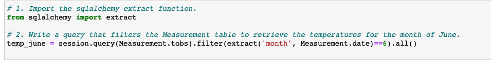
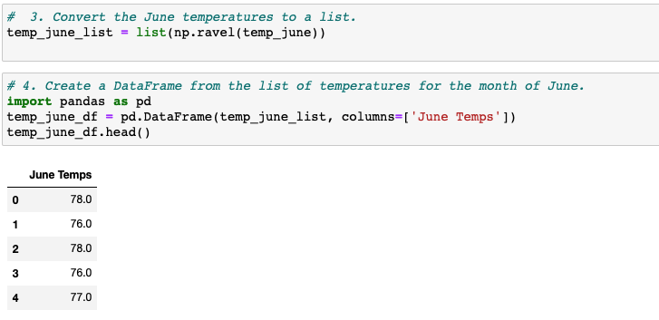
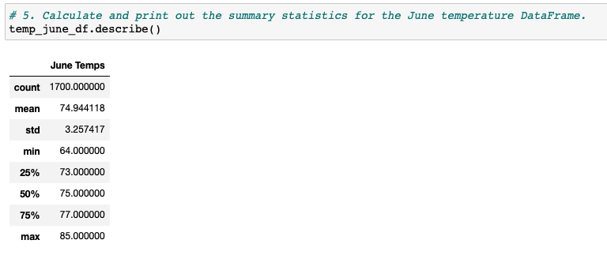
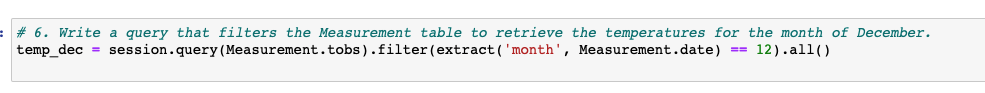
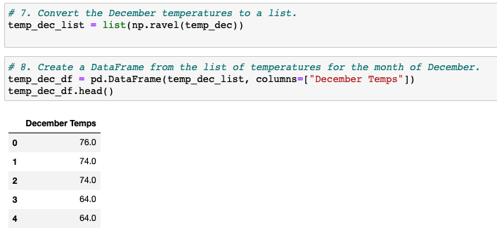
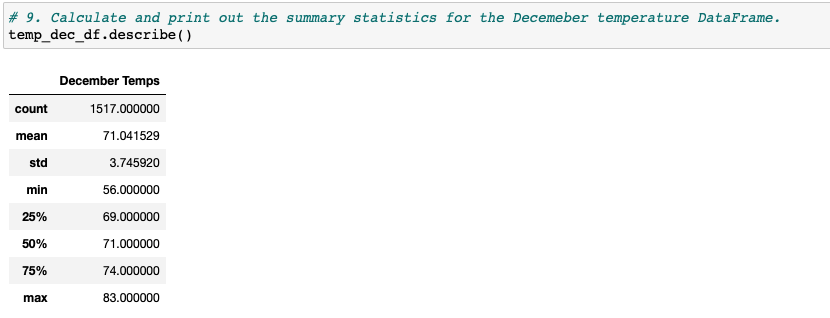
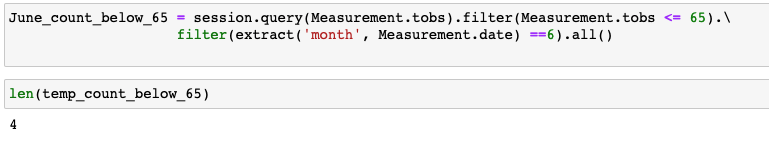
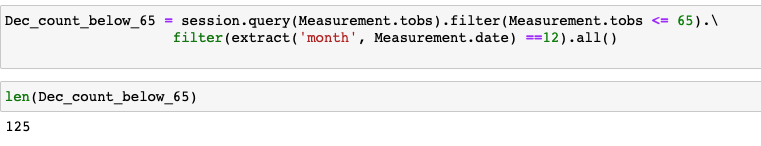
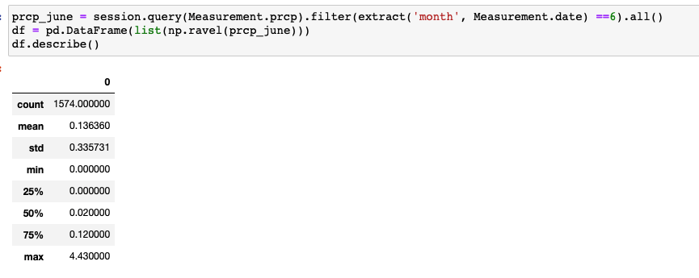
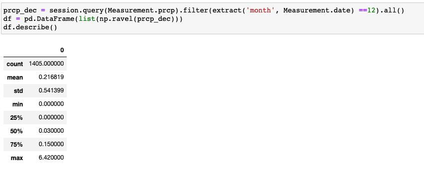

# surfs_up

## Overview
We have been working to present a business plan to investors for opening up a Surf n' Shake shop servicing surfboards and ice cream to locals and tourists in Oahu, an island in Hawaii. One of the investors have requested analytics on some of the weather datasets in Oahu as he is espcially concerned about the weather influncing sales. After completed some initial analysis, the investor wants more information on temperature trends in order to determine if the surf and ice cream shop business is sustainable year-round.

## Purpose
The purpose for this analysis is to generate some summary statistics on the weather dataset for the months of June and December. For this analysis, we will be querying a SQLite database using SQLAlchemy querying tool. 

## Resources
- Tools: 
  - Jupyter Notebook
  - Python (Pandas, Sqlalchemy, numpy)

- Database:
  - hawaii.sqlite

## Results

### Deliverable 1:

We began by importing the necessary dependencies. Then we used the code below to query and filter the Measurement table for temperatures for the month of June. 

We then converted the results into a list, then into a pandas DataFrame:

lastly we obtained the summary statistics for the DataFrame using the ***describe()*** function:

The June Temperature summary reflects the following findings:
 - there are 1700 temperature data collected for the month of June from the given ***hawaii.sqlite*** datasets 
 - the average temperature for June is 74.94 °F
 - the minimum temperature for June is 64.00°F
 - the maximum temperature for June is 85.00°F
 - the standard deviation for June Temperature is 3.26°F
 - the 1st, 2nd and 3rd Quartiles for June Temperatures are 73.00°F, 75.00°F,and 77.00°F respectively. 
 

### Deliverable 2:

Similar steps to Deliverable 1, we first queried and filtered the Measurement table to retrieve temperature recordings for the month of December:

Then we converted the results into a list, then into a pandas DataFrame:

Lastly we obtained the summary statistics for the DataFrame using the ***describe()*** function:

The December Temperature summary reflects the following findings:
 - there are 1517 temperature data collected for the month of December from the given ***hawaii.sqlite*** datasets 
 - the average temperature for December is 71.04 °F
 - the minimum temperature for December is 56.00°F
 - the maximum temperature for December is 83.00°F
 - the standard deviation for December Temperature is 3.75°F
 - the 1st, 2nd and 3rd Quartiles for December Temperatures are 69.00°F, 71.00°F,and 74.00°F respectively. 

### Analyzing the two Deliverables:
- the average recorded temperture for June and December are very similar
    - The average temperature for June is 74.94 °F . It is only 3.90°F higher than the average temperature for December which is 71.04°F. 
    - It is a positive sign that weather in Oahu is quite stable and sustainable and has little fluctuation
- the maximum temperature for June and December are also very similar
    - the maximum temperature for June is 85.00°F, and it is only 2.00°F higher than the maximum temperature for December which is 83.00°F
- the minimum temperature for June and December show some level of variance
    - the minimum temperature for June is 64.00°F, and it is 8.00°F higher than the minimum temperature for December which is 56.00°F
- there are more temperature data recorded in June compare to December
    - there are 1700 temperature data recorded in June, comparing to only 1517 data recorded in December

## Summary
Overall the recorded temperature trend in June and December are very similar, which may indicate that the year-round weather condition is relatively sustainable to support surfing and ice cream shop business. The average temperature for June and December are very much alike, and the maximum temperature for the two months are also very close. The main difference is between their minimum temperatures, where December has a much lower recorded minimum temperature comparing to June. 

In order to explore further on the potential impact of December weather on surf and ice cream sales, we could perform couple additional queries on the weather dataset.

### Additional Query 1:
Assuming temperatures 65°F (18°C) and lower are cooler weathers that are difficult for surfing and selling ice cream, we could create some queries to find out how many recordings are there in June and December respectively that are in this range.

**June:**

**December:**

Surprisingly, although the mean temperatures between the two months are similar they actually have a different distribution. December has significantly more colder temperatures comparing to June. Specifically, there are 125 recordings of temperatures below 65°F in December and only 4 of the same recordings in June. As a result, the surfing and ice cream business may be negatively impacted in the winter months by the cooler temperatures.

### Additional Query 2:
We could run another query and get a summary statistics on the precipitaion data for June and December to determine which month has more rainy weather.
The code will be similar to the analysis:

**June:**

**December:**

As a result, a more rainy weather is observed in December that is possibly due to cooler air temperatures. It has a higher average precipitaion and a higher maximum precipication compared to June. This again may negatively impact the surfing and ice cream business in the winter months.

